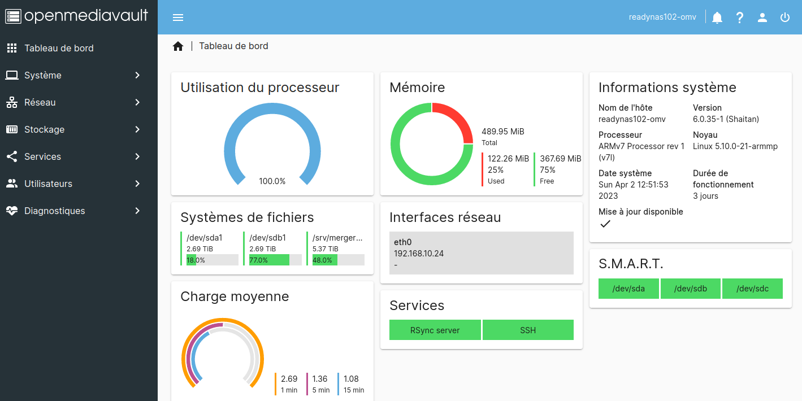
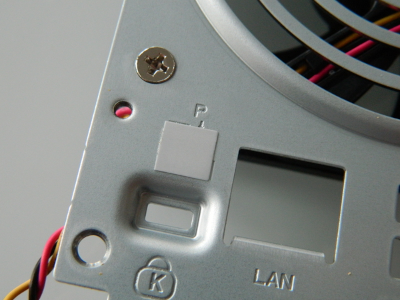
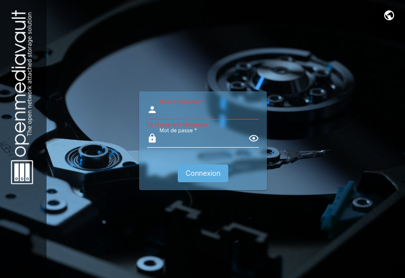

# ReadyNAS-102 under Debian Bullseye & Open Media Vault 6

During some holidays, while digging into some cupboard, I found an almost brand new Netgear ReadyNAS 102. It was bought in 2015 and almost untouched.

Specs wise, this NAS is running a single core ARMv7 800MHz with 512Mb RAM. 

As I was actually needing a backup NAS, I decided to revive this ReadyNAS NAS by installing a brand new :
  * **Debian** 11 Eyesbull
  * **Open Media Vault** 6.0

As I wanted to minimise the risk and to have installation reversible, I decided to opt for an OS installation on a external USB SSD disk plugged to the NAS.

Checking on the net, I found a lot of very interesting informations, but no simple guide. So, here is a step by step guide to install Debian 11 + OMV 6.0  on a USB disk that will transfom your old ReadyNAS 102 into a versatile OMV NAS.

It has been tested from a Linux workstation also running Debian Eyesbull.

With very little adaptation, this guide should be also applicable to ReadyNAS-104.

In this guide, different operations will be performed either from a linux workstation or from the NAS itself. As this can be quite confusing, I’ll follow this simple rule :
  * linux workstation shell prompt starts with **#**
  * NAS shell prompt starts with **$**

# Prepare the USB key / SSD disk

As the USB key will be the NAS main drive and will hold the complete system, it should be as fast as possible and 16Gb should be a comfortable minimum.

All following operations should be done from any Linux workstation. I did it on a debian Buster Server.

First step is to format the USB key / disk with a single Ext2 partition and to label it **rootfs**.

We are using **ext2** partition to avoid journaling. This will protect USB key from tear-off and it should not be a problem as root partition will be mostly static after installation.

Next, we need to install debootstrap environment :

~~~
# apt install debootstrap qemu-user-static
~~~

We will create /root/rootfs where the minimal Debian system will be created :

~~~
# sudo su
# cd /root
~~~

We can now run debootstrap to create minimal filesystem :

~~~
# debootstrap --verbose --foreign --arch=armhf --variant=minbase --include=init,dialog,locales,udev,ifupdown,mtd-utils,procps,iproute2,iputils-ping,isc-dhcp-client,ne,nano,wget,netbase,acl,openssh-server,avahi-daemon,python2-minimal,python3-minimal,u-boot-tools,lsb-release,htop,iotop,net-tools bullseye rootfs http://http.debian.net/debian
~~~

It’s now time to chroot to the new rootfs structure :

~~~
# cp /usr/bin/qemu-arm-static ./rootfs/usr/bin
# mount -t proc none ./rootfs/proc
# mount -o bind /dev ./rootfs/dev
# chroot rootfs
~~~

We are logged in the new NAS filesystem. 

As we have done a cross architecture debootstrap, we need to launch the second stage installation and then to finalise installation.

~~~
# ./debootstrap/debootstrap --second-stage
# wget --no-check-certificate -O /etc/apt/sources.list https://raw.githubusercontent.com/NicolasBernaerts/readynas-102/master/bullseye/sources.list
 
# apt update
 
# dpkg-reconfigure locales
# dpkg-reconfigure tzdata
  
# wget --no-check-certificate -O /etc/kernel/postinst.d/zz-local-build-image https://raw.githubusercontent.com/NicolasBernaerts/readynas-102/master/bullseye/zz-local-build-image
# chmod a+x /etc/kernel/postinst.d/zz-local-build-image
  
# apt install linux-image-armmp

# wget --no-check-certificate -O /etc/hostname https://raw.githubusercontent.com/NicolasBernaerts/readynas-102/master/bullseye/hostname

# wget --no-check-certificate -O /etc/fw_env.config https://raw.githubusercontent.com/NicolasBernaerts/readynas-102/master/bullseye/fw_env.config
  
# wget --no-check-certificate -O /etc/fstab https://raw.githubusercontent.com/NicolasBernaerts/readynas-102/master/bullseye/fstab

# nano /etc/systemd/system.conf
~~~

    ...
    DefaultTimeoutStopSec=30s
    ...

~~~
# wget --no-check-certificate -O /etc/network/interfaces https://raw.githubusercontent.com/NicolasBernaerts/readynas-102/master/bullseye/interfaces

# nano /etc/ssh/sshd_config
~~~

    ...
    PermitRootLogin yes

~~~
# wget --no-check-certificate -O /etc/modules https://raw.githubusercontent.com/NicolasBernaerts/readynas-102/master/bullseye/modules
# wget --no-check-certificate -O /etc/initramfs-tools/modules https://raw.githubusercontent.com/NicolasBernaerts/readynas-102/master/bullseye/modules
~~~

ReadyNAS 102 is loosing date during startup (realtime clock battery may be dead).

So it is necessary to setup the date after every start. This is declared as a service where date is taken from an old Google redirection page.

~~~
# wget --no-check-certificate -O /usr/local/sbin/init-date https://raw.githubusercontent.com/NicolasBernaerts/readynas-102/master/bullseye/init-date
# chmod +x /usr/local/sbin/init-date
# wget --no-check-certificate -O /etc/systemd/system/init-date.service https://raw.githubusercontent.com/NicolasBernaerts/readynas-102/master/bullseye/init-date.service
# systemctl enable init-date.service
~~~

With Debian, activity LED are not managed anymore. The following service updates LED every 200ms according to the disk activity.

If any data is written or read from a disk, the activity LED is blinking. Backup LED is used for the USB key or USB SDD.

~~~
# wget --no-check-certificate -O /usr/local/sbin/led-activity https://raw.githubusercontent.com/NicolasBernaerts/readynas-102/master/bullseye/led-activity
# chmod +x /usr/local/sbin/led-activity
# wget --no-check-certificate -O /etc/systemd/system/led-activity.service https://raw.githubusercontent.com/NicolasBernaerts/readynas-102/bullseye/buster/led-activity.service
# systemctl enable led-activity.service

# apt clean
# rm /tmp/* /var/cache/debconf/*
# pwconv
# passwd
# exit
~~~

rootfs directory structure is now ready to be transfered to the USB key :

~~~
# umount rootfs/proc
# umount rootfs/dev
# cp -arv /root/rootfs/* /media/nicolas/rootfs/
# sync
~~~

The USB key is now ready to be plugged to the ReadyNAS 102 for its first Debian Bullseye boot !

You can umount and remove it from your linux workstation.

# Serial Configuration

During the installation process, we need to have access to the ReadyNAS 102 serial console.

It can be easily accessed by removing the grey sticker at the back of the ReadyNAS.

Once the sticker is removed, you’ll gain access to a 4 pins connector. When you have the connector in front of you, pinout is as follow :

    | Rx   |  Tx   |
    | Gnd  |  Vcc  |

You just need to connect it to your computer thu a 3.3V USB serial dongle.

Make sure to use a 3.3V adapter or you can damage your ReadyNAS.

Once your USB adpater is connected, launch any serial terminal (I personaly use GtkTerm) and configure it for 115200 bauds, 8 bits, no parity, 1 stop bit and no flow control.
 
You are ready to plug your ReadyNAS 102 to the mains and to press the power button for the boot process to start.

~~~
  BootROM 1.08
  Booting from NAND flash
  General initialization - Version: 1.0.0
  High speed PHY - Version: 2.1.4 (COM-PHY-V20) 
  Update PEX Device ID 0x6710
  High speed PHY - Ended Successfully
  0000
  DDR3 Training Sequence - Ver 5.7.1
  DDR3 Training Sequence - Run without PBS.
  DDR3 Training Sequence - Ended Successfully 
  BootROM: Image checksum verification PASSED
   __   __                      _ _
  |  \/  | __ _ _ ____   _____| | |
  | |\/| |/ _` | '__\ \ / / _ \ | |
  | |  | | (_| | |   \ V /  __/ | |
  |_|  |_|\__,_|_|    \_/ \___|_|_|
           _   _     ____              _
          | | | |   | __ )  ___   ___ | |_ 
          | | | |___|  _ \ / _ \ / _ \| __| 
          | |_| |___| |_) | (_) | (_) | |_ 
           \___/    |____/ \___/ \___/ \__| 
   ** LOADER **
  
  U-Boot 2011.12-gec25d27-dirty (Oct 26 2015 - 16:53:05) Marvell version: v2011.12 2014_T2.0p1 
  06/23/2015 ReadyNAS-102 V2.0
  
  Board: DB-88F6710-BP
  SoC:   MV6710 A1
  CPU:   Marvell PJ4B v7 UP (Rev 1) LE
         CPU    @ 1200 [MHz]
         L2     @ 600 [MHz]
         TClock @ 200 [MHz]
         DDR    @ 600 [MHz]
         DDR 16Bit Width, FastPath Memory Access
  DRAM:  512 MiB
  
  Map:   Code:		0x1feef000:0x1ff9ef34
         BSS:		0x1ffef0a0
         Stack:		0x1f9eeef8
         Heap:		0x1f9ef000:0x1feef000
  
  NAND:  (ID 0xf12c)	128 MiB
  MMC:   MRVL_MMC: 0
  Bad block table found at page 65472, version 0x01
  Bad block table found at page 65408, version 0x01
  
  Initialize and scan all PCI interfaces
  PEX unit.port(active IF[-first bus]):
  ------------------------------------------
  PEX 0: Root Complex Interface, Detected Link X1, GEN 2.0
  PEX 1: Root Complex Interface, Detected Link X1, GEN 2.0
  FPU not initialized
  USB 0: Host Mode
  USB 1: Host Mode
  Shutting down unused interfaces:
         GBE0
         SDIO
         AUDIO
         TDM
  Modules/Interfaces Detected:
         RGMII1 Phy
         PEX0 (Lane 0)
         PEX1 (Lane 1)
         SATA0 (Lane 2)
         SATA1 (Lane 3)
  Net:   , egiga1 [PRIME]
  Power On!
  
  FDT loaded successfully
  Hit any key to stop autoboot:  0 
~~~

You’ll be presented a 3 seconds message to stop the boot process and get a prompt.

When you get the message press any key (like SPACE). You now have a Marvel prompt.

    Marvell>>

First step is to print the Marvel environment and to save it to a text file. This may be useful in case you change an unexpected value later in the process. You’ll then be able to restore the original value.

~~~
Marvell>> printenv
    AC_Power_fail_detect=open
    CASset=min
    HW_version=MVT
    MALLOC_len=5
    Manufacturer=NETGEAR
    Product=ReadyNAS 102
    SKUNum=RN102
    SerialNum=3ERD54EY00496
    Startup=Normal
    UUID=39c9646a-e292-11e4-a0de-e8fcafe61843
    Version=V1.0
    autoload=no
    ...
    vxworks_en=no
    yuk_ethaddr=00:00:00:EE:51:81
    Environment size: 2504/131068 bytes
~~~

We will increase slightly the delay to get access to the prompt. We will set it to 5s instead of 3s and then save it to the NAND memory.

~~~
  Marvell>> setenv bootdelay 5
  Marvell>> saveenv
    Saving Environment to NAND...
    Erasing Nand...
    Writing to Nand... done
~~~

To restart the boot process, you can just run the boot command :

    Marvell>> boot

We can now prepare the boot on the new USB key.

# Boot under Debian Bullseye

Make sure your ReadyNAS 102 is switched off.

Plug the USB key to the front USB port (only that one is usable during boot process ...).

Launch your serial console and power up the NAS. When you get the count down message, interrupt boot process by pressing SPACE. 

It’s now time to adapt the Marvel environment to boot from the USB key. Copy and paste the following commands on the serial console (MAC address should be the one one the manufacturer sticker) :

~~~
  Marvell>> setenv ethaddr 'E8:FC:AF:xx:xx:xx'
  Marvell>> setenv load_uimage 'ext2load usb 0:1 0x2000000 /boot/uImage'
  Marvell>> setenv load_uinitrd 'ext2load usb 0:1 0x3000000 /boot/uInitrd'
  Marvell>> setenv fdt_skip_update yes
  Marvell>> setenv bootcmd_stock 'ubi part ubifs; ubifsmount rootfs; ubifsload 0x2000000 kernel; ubifsload 0x3000000 initrd.gz; bootm 0x2000000 0x3000000 0x1000000'
  Marvell>> setenv set_bootargs_debian 'setenv bootargs console=ttyS0,115200 root=LABEL=rootfs rootdelay=10 $mtdparts earlyprintk=serial'
  Marvell>> setenv bootcmd_debian 'run load_uinitrd; run set_bootargs_debian; bootm 0x2000000 0x3000000'
  Marvell>> setenv bootcmd 'usb reset; if run load_uimage; then run bootcmd_debian; else run bootcmd_stock; fi; reset'
~~~

If you want the boot to the USB key to become permanent, you need to save this new environment to the NAND.

But make sure to have validated at least one successful boot before saving the new environment. 

~~~
  Marvell>> saveenv
    Saving Environment to NAND…
    Erasing Nand…
    Writing to Nand... done
~~~

You are now ready to boot under Debian Bullseye : 

~~~
  Marvell>> boot
~~~

You should see the loading of uimage, uinitrd and then the Debian boot process !

If everything goes fine, you’ll get the login prompt.

You can now log to your new debian box thru the serial console or thru SSH with **root / root** credential.

Your NAS should be accessible on the LAN thru its default hostname **readynas102-debian.local**

## Packages and Kernel update

Log in to your new Debian NAS.

Check what kernel is running.

~~~
$ uname -a 
Linux readynas102-omv 5.10.0-15-armmp #1 SMP Debian 5.10.120-1 (2022-06-09) armv7l GNU/Linux
~~~

Set current time (needed for certificates handling) :

~~~
$ date +"%d %b %Y %T %Z" -s "$(wget -qSO- --max-redirect=0 http://google.com 2>&1 | grep '^  Date:' | cut -d' ' -f 5-)"
~~~

Update all installed packages (forcing device clock) :

~~~
$ hwclock --hctosys
$ apt update
$ apt upgrade
$ apt install resolvconf apt-utils
~~~

Check firmware access :

~~~
$ fw_printenv
~~~

Enable and start date initialisation service :

~~~
$ systemctl enable init-date
Created symlink /etc/systemd/system/multi-user.target.wants/init-date.service → /etc/systemd/system/init-date.service.
$ systemctl start init-date
$ systemctl status init-date
● init-date.service - system date initialisation
   Loaded: loaded (/etc/systemd/system/init-date.service; enabled; vendor preset: enabled)
   Active: inactive (dead) since Tue 2022-07-05 02:00:00 CEST; 11s ago
 Process: 17587 ExecStart=/usr/local/sbin/init-date (code=exited, status=0/SUCCESS)
 Main PID: 17587 (code=exited, status=0/SUCCESS)
      CPU: 74ms
~~~

Enable and start LED activity service :

~~~
$ systemctl enable led-activity
Created symlink /etc/systemd/system/multi-user.target.wants/led-activity.service → /etc/systemd/system/led-activity.service.
$ systemctl start led-activity
$ systemctl status led-activity
● led-activity.service - disks LED activity
   Loaded: loaded (/etc/systemd/system/led-activity.service; enabled; vendor preset: enabled)
   Active: active (running) since Thu 2021-01-07 22:11:55 CET; 33s ago
 Main PID: 17429 (led-activity)
    Tasks: 5 (limit: 1092)
   Memory: 928.0K
   CGroup: /system.slice/led-activity.service
           ├─17429 /bin/bash /usr/local/sbin/led-activity
           └─18600 /bin/bash /usr/local/sbin/led-activity
~~~

## Set fixed IP

~~~
# nano /etc/network/interfaces
~~~

    source /etc/network/interfaces.d/*
    
    auto lo
    iface lo inet loopback
    
    auto eth0
    iface eth0 inet static
    address 192.168.10.24
    broadcast 192.168.10.255
    netmask 255.255.255.0
    gateway 192.168.10.1
    dns-nameservers 192.168.10.1

~~~
$ rm /etc/resolv.conf
$ nano /etc/resolv.conf
~~~

    search domain.name
    nameserver 192.168.x.1
    nameserver 8.8.8.8
    nameserver 1.1.1.1
    nameserver 1.0.0.1

~~~
$ systemctl restart networking.service
~~~

## Log Rotate

If you are using **openmediavault-flashmemory** plugin or any **folder2ram** configuration for logs, it may overflow your RAM and crash your NAS.

So, it is important :
  * to run logrotate every hour instead of every day
  * to limit kern.log and syslog file size to 10MB
  * rotate logs on 1 file only

~~~
$ mv /etc/cron.daily/logrotate /etc/cron.hourly/logrotate
$ nano /etc/logrotate.conf
~~~

    # see "man logrotate" for details
    
    # max log size is 10Mb
    maxsize 10M
    ...
    # keep 1 week worth of backlogs
    rotate 7 
    ...

~~~
$ sed -i '/rotate [0-9]/d' /etc/logrotate.d/*
$ rm /var/log/*.log.* /var/log/*/*.log.*
$ service logrotate restart
~~~

## Force Ethernet to 100Mb

Because of CPU limitation, kernel and syslog logs are filled with overrrun error messages.

~~~
$ dmesg
[ 1423.760299] mvneta d0074000.ethernet eth0: bad rx status 0f830000 (overrun error), size=448
[ 1423.973064] mvneta d0074000.ethernet eth0: bad rx status 0f830000 (overrun error), size=336
[ 1424.230631] mvneta d0074000.ethernet eth0: bad rx status 0f830000 (overrun error), size=1088
~~~

These messages are coming from the fact that the CPU can’t cope with Gbits network traffic, especially if you deal with a rsync copy, which is overflowing network card buffer. 

This is not dangerous as there is no data loss when you deal with TCP connexions. 

But it is filling **kern.log** and **rsyslog** with a huge amount of useless messages.

aS Ethernet speed is to fast for the poor single core ARM processor, It should be lowered to 100Mb :

~~~
$ ethtool -s eth0 speed 100
~~~

## Install Open Media Vault

You just need to follow the standard [Debian installation procedure](https://openmediavault.readthedocs.io/en/6.x/installation/on_debian.html)

~~~
$ apt install --yes gnupg ca-certificates
$ wget -O "/etc/apt/trusted.gpg.d/openmediavault-archive-keyring.asc" https://packages.openmediavault.org/public/archive.key
$ apt-key add "/etc/apt/trusted.gpg.d/openmediavault-archive-keyring.asc"
$ nano /etc/apt/sources.list.d/openmediavault.list
~~~

    deb https://packages.openmediavault.org/public shaitan main
    # deb https://downloads.sourceforge.net/project/openmediavault/packages shaitan main
    ## Uncomment the following line to add software from the proposed repository.
    # deb https://packages.openmediavault.org/public shaitan-proposed main
    # deb https://downloads.sourceforge.net/project/openmediavault/packages shaitan-proposed main
    ## This software is not part of OpenMediaVault, but is offered by third-party
    ## developers as a service to OpenMediaVault users.
    deb https://packages.openmediavault.org/public shaitan partner
    # deb https://downloads.sourceforge.net/project/openmediavault/packages shaitan partner

~~~
$ export LANG=C.UTF-8
$ export DEBIAN_FRONTEND=noninteractive
$ export APT_LISTCHANGES_FRONTEND=none
$ apt update
$ apt-get --yes --auto-remove --show-upgraded --allow-downgrades --allow-change-held-packages --no-install-recommends --option DPkg::Options::="--force-confdef" --option DPkg::Options::="--force-confold" install openmediavault-keyring openmediavault
$ omv-confdbadm populate
~~~

Declare **Extra Plugins** repository :

~~~
$ wget -O - https://github.com/OpenMediaVault-Plugin-Developers/packages/raw/master/install | bash
~~~

Install **MergerFS** :

~~~
$ apt install openmediavault-mergerfs
~~~

You should get [OpenMediaVault connexion page](http://readynas102-debian.local/) !

To protect your USB Key, you can also install plugin **openmediavault-flashmemory**.
